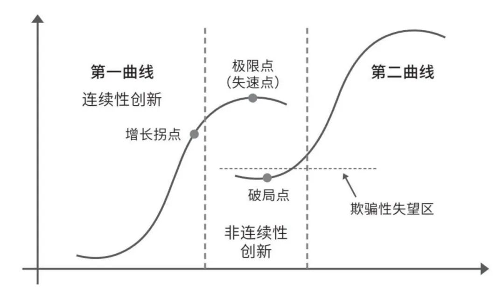

# 项目报告
## 基于Faster RCNN
### 项目概述
基于 PyTorch 和 torchvision，采取 `fasterrcnn_resnet50_fpn` 模型  
由于 PyTorch 在目标检测任务中默认将背景类别设为 0，实际训练时将类别编号加 1，预测输出后再减 1

### 实现思路
1. **基础实现**
   - 完成模型的基础搭建，仅确保模型能够正常运行
   - 将数据集按`9:1`的比例划分为训练集和验证集，并设置早停以避免过拟合
   - **结果**：模型成功运行，得分从初始的 `0.2774` 提升至 `0.3216`
2. **backbone替换**
   - 尝试使用更强大的 `fasterrcnn_resnet50_fpn_v2` 作为backbone以提升性能
   - **结果**：性能未达预期，可能是数据集规模较小可能导致复杂模型过拟合，而中小型模型更具优势
3. **k折交叉验证**（k=5）
   - 尝试`average` `max` `nms`多种集成策略
   - 进行K折模型集成、分别预测
   - **结果**：使用K折集成验证+`nms`策略时得分最高，最佳 `0.3338`

## 数据清洗
针对数据集噪声问题，开发了数据清洗脚本，主要处理以下情况：
- 移除部分或完全位于图片外的检测框
- 移除发生错误的检测框

但在数据清洗后预测结果得分**显著下降**，分析原因如下：
- 移除部分非法检测框时，误删了有效目标区域
- 人工判断"错误"的标注，可能为边界模糊或遮挡的困难样本，也许会模型泛化能力

## 基于YOLOv8
在做完第一个项目后，得到的结果还是不尽人意，结合相关资料对Faster RCNN作了许多尝试，得分不升反降，似乎到达瓶颈。于是在网上搜索其他方法用于目标检测。  
最终选择 Ultralytics 团队开源的 YOLOv8 模型作为替代方案，该团队提供了完善的文档和API接口，且社区中有大量基于 YOLOv8 的应用案例，便于快速开发与部署。此外，YOLOv8 模型结构轻量化，计算复杂度较低，适合在GPU资源有限的情况下运行。

### 项目概述
借助 Ultralytics 库中的 YOLOv8 模型，实现检测与分类  
转换为 YOLO 支持的数据集格式，划分训练集、验证集（8:2）

### 实现思路 
1. **基础实现**
   - 完成基础配置和训练流程
   - **结果**：模型成功运行，刚开始得分就来到 `0.3151` ，从这里看到一丝成功的希望
2. **预测优化**
   - 调整非极大值抑制（NMS）阈值，采用测试时增强（TTA）
   - **结果**：得分显著提升至 `0.3377` ，已经比第一个项目的最高得分要高
3. **优化器实验**
   - 尝试`Adam`、`RMSprop`等不同优化器
   - **结果**：性能未提升，分析可能原因是默认优化器已足够适合当前任务
4. **模型结构调整**
   - 尝试不同规模的YOLOv8模型（s → n/m）
   - **结果**：性能未提升，原因同与Faster RCNN项目类似，小模型在样本不足时表现更好
5. **调整训练参数**
   - **数据增强**：启用马赛克增强、混合增强等，提升泛化能力，得分从`0.3384` 升至 `0.3591`
   - **图像尺寸**：增大/减小 `imgsz` 的尝试未带来提升
   - **epochs**：`epochs=50` 时得分最佳，其余尝试并未有提升
   - **batch_size**：`batch_size=10` 时得分最佳，来到 `0.3620`

## 任务心得
刚接触到这个项目，由于我在计算机视觉方面有一些基础，于是想到用Faster RCNN来解决这个问题，然而结果不太尽如人意，即使对此方法做出许多优化，最后的排名也止步于第四。  

缺少改进思路的我在网上查阅相关资料后，更换至YOLO，随着进一步优化，最后排名也上升到第一。前前后后耗时大约有五天，后续也因为一些时间冲突没有继续优化或是做别的项目，也算是给了前两天望着怎么也提不上排名的我一个比较好的交代了。最后用之前在网上看到的图总结一下我的项目进展与心路历程，感觉总体上还是很契合的。

我一直认为，一个好的考核项目是可以让人从中学习到东西的。毋庸置疑的是我的确学到了很多，写了很多代码却没有起到作用，一两行不起眼的改动可能提高预测得分……也很感谢老师能给我这次机会，相较于其他院校夏令营的考核方式我认为合理很多，虽然一开始上手可能有点困难。

一些建议：
- 适当增加一些训练数据，自行搜寻或生成数据的效率、效果均较差
- 平台的评测基准可以部分公开，让参赛者有优化的大致方向
